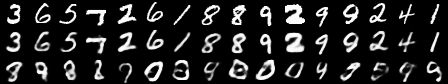

# Deep Learning Course
Deep Learning homework repository  
### Homework1
Numpy familiarization. Matrix Operation warming up. And Linear Regression via Analytical Solution Numpy implementation.  
  
### Homework2
Exclusive or problem proof. Hidden Markorv Models, and Linear-Gaussian Prediction models warming up. And L2-regularized Linear Regression via Stochastic Gradient Descent Numpy implementation.  
  
### Homework3
Proof of fast convergence Newton's method. Calculation of Derivation of softmax regression gradient updates. Numpy implementation of Softmax Regression using MNIST dataset with stochastic gradient descent to minimize the cross-entropy loss function.  
  
### Homework4
Numpy implementation, training and tuning of a multi-layer neural network to classify images of hand-written digits from the MNIST dataset. Hyperparameter tuning including number of hidden layers, number of units in each hidden layer, learning rate, minibatch size, number of epochs, and $L_2$ Regularization strength applied to the weight matrices. The accuracy (percentage correctly classified test images) is over 96.5%.  
  
### Homework5
Numpy implementation of a Recurrent Neural Network. Trained the model to obtain a loss value less than 0.05.  
  
### Homework6
Tensorflow warming up using fashion mnist dataset. Trained a multi-layer neural networks with a accuracy of 88%. Trained a Convolutional Neural Network with an accuracy of 93%.  
  
### Homework7
Tensorflow implementation of Variational Auto-Encoders on MNIST. Used it to to generate novel images of handwritten digits.  

  
